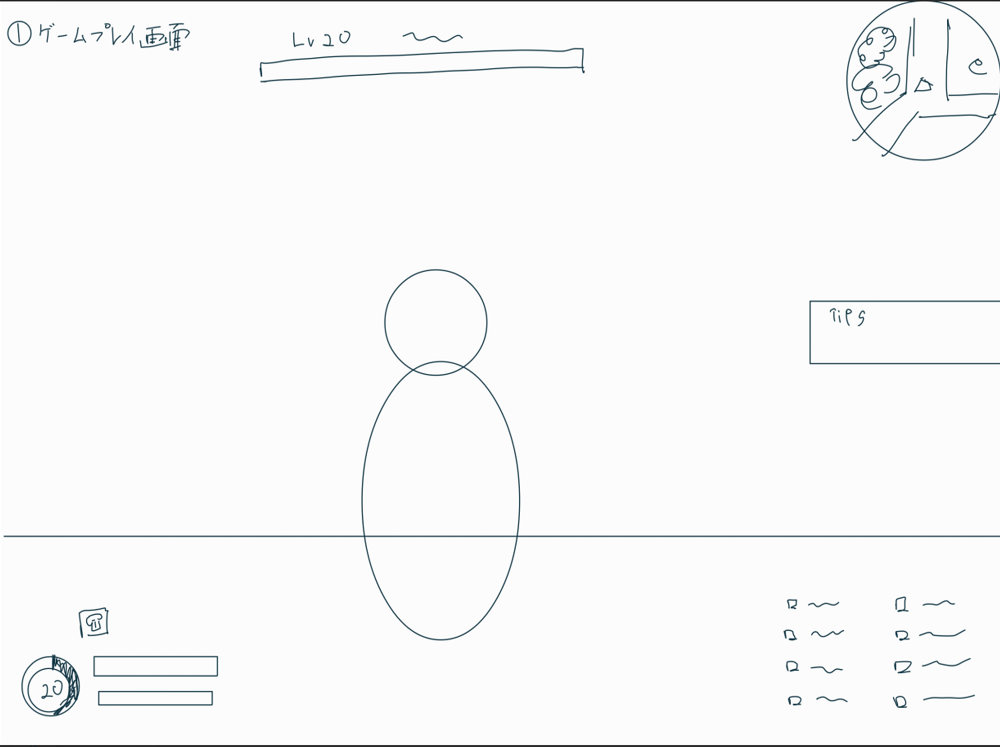
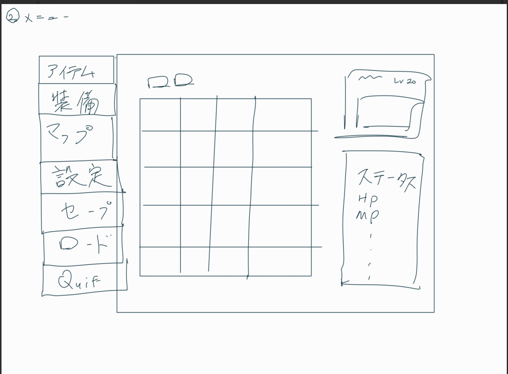

# 外部設計書
## 画面設計

|キー|説明|	
|---|---|	
|WASD|	移動|	
|スペース	|ジャンプ |
|左クリック	|通常攻撃 |
|右クリック	|通常魔法攻撃|	
|Q	|アビリティ１	 |
|E	|アビリティ２	 |
|Z	|アビリティ３	 |
|C	|アビリティ４	 |
|1	|アビリティ５	 |
|2	|アビリティ６	 |
|3	|アビリティ７	 |
|4	|アビリティ８	 |
|F	|インタラクト	 |
|Esc	|メニュー画面|	

## 機能
### 移動，ジャンプ
- WASD操作で移動
- ジャンプで崖を超えられる
- よじ登りは実装しない
### 通常攻撃
- ４段のコンボ攻撃
- 空中攻撃
### 通常魔法攻撃
- 追尾する魔法を飛ばす
- 空中で発動すると高く飛ぶ
### アビリティ
- プレイヤーが指定したキーに任意のアビリティをセットできる
- キーを押すとセットしたアビリティを発動できる
### インタラクト
- アイテムをとる
- ギミックを作動する（扉を開ける等）
### ステータス
- ダメージ処理，バフ処理が適用される
- 状態異常管理が行える
### 装備
- 装備することでステータスが変化する，特殊効果を発動する装備も存在する
- 装備品が頭，上半身，下半身，アクセサリー１，アクセサリー２と分類されている
- 装備（外す），ステータスを見る，捨てるの操作を行える
### アイテム
- 使用アイテム，素材，大事なものに分類される
- 使用アイテムは使う，捨てるの操作を行える
- 素材は捨てるの操作を行える
- 大事なものは操作を行えない
### 設定
- 知識がないので後回し
### マップ
- マップを表示する
- 自分の位置が表示される
- (マーカーや目印機能)
### セーブ，ロード
- 知識がないので後回し
### 敵
- プレイヤーが取れるようなアクションは基本的にできる
- 固有のステータス，アビリティを持つ
- ボスモンスターはHPバーの表示など特殊演出をする